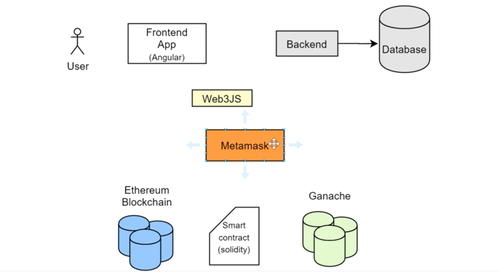
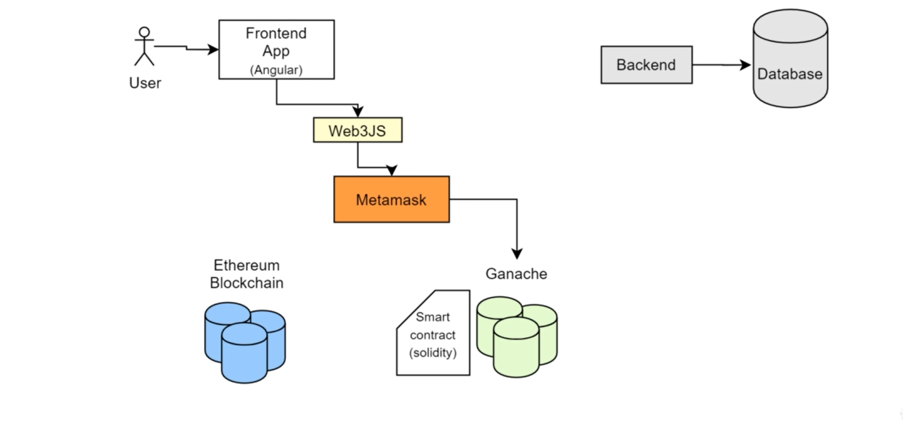

# Blockchain Web Development Project

Development of decentralized web application powered by Ethereum blockchain



Blockchain is a system of recording information in a way that makes it difficult or impossible to change, hack, or cheat the system. It's is essentially a digital ledger of transactions that is duplicated and distributed across the entire network of computer systems on the blockchain.

### TODO (Intro):

- Introduction about Project Architecture and setting up the environment.
- Front end Application
- Smart Contract and Blockchain
- Connecting it all together middle ware
- Mention the tools you're using:
  1. Angular Js
  2. Smart Contract + Ethereum Blockchain/Ganache
  3. Web3JS + Metamask

### Here are the steps we'll follow:

1. We're going to build the frontend of the application using Angular Js (Optional: VueJS, React Js).
2. We build the actual smart contract.
3. Frontend and the smart contract have know knowledge of each other to connect them we will use the middle ware library Web3JS which then connect with meta mask.
4. Metamark is plucin which contact with the blockchain directly and connect with the front end.



Ganache is a local Blockchain which we will mostly work for testing purpose after the project is completed we add our project on main Ethereum Blockchain.

## 1. **Setting up environment**

### 1. Since we will be working with the angular:

```bash
npm install -g @angular/cli@9.1.3
```

### 2. Create a new folder "Blockchain web app"

```bash
cd [folder location]
ng new blockchain-poll --directory ./
```

1. Would you like to add Angular routing? No
2. Which stylesheet format would you like to use? SCSS
3. To check if the project is working

```bash
npm start
```

After successfull run the project will work on
**http://localhost:4200/**

4. Delete all the Html Code From
   **_src/app/app.component.html_**
   "this will be you main HTML body add whatever Html Code you want to write in and it will get printed on the website"

   "if you want to add any CSS or JS file in the website add the src/link file in"
   **_src/index.html_**

## 2. **Frontend application**

## 3. **Smart Contract and blockchain**

## 4. **Connectinng it all together middleware**
